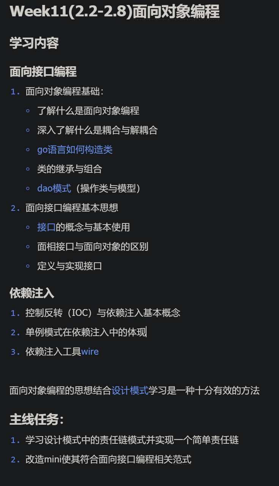

# Deepseek

## 

这个主线任务设计得非常好，它将你本周学习的所有核心知识点（**面向接口编程、组合、依赖注入**）都串联到了一个经典的设计模式——**责任链模式**的实践中。

下面我将详细拆解这个任务，告诉你如何一步步完成它。

---

### 第一部分：理解责任链模式

在动手写代码之前，需要先理解这个模式是什么。

**1. 核心概念**
责任链模式是一种行为设计模式，它将请求的发送者和接收者解耦。模式将多个处理器（Handler）连成一条链，请求沿着这条链传递，直到某个处理器决定处理它为止。

**2. 现实类比**

想象一个公司内部的审批流程：

- **员工** 申请购买一台新电脑（这就是“请求”）。
- **组长**：只能审批金额 5000 元以下的申请。
- **部门经理**：只能审批金额 10000 元以下的申请。
- **总监**：可以审批任意金额。

当员工发起申请时，组长先看。如果金额超出权限，组长就把申请传递给经理；经理如果也超出权限，就传递给总监。在这个过程中，**员工不需要知道谁会最终审批，他只需要把申请提交给链上的第一个节点（组长）即可**。

---

### 第二部分：将任务与本周学习内容关联

要实现这个模式，你会用到本周学的这些知识：

1. **面向接口编程**
   - 你需要定义一个 `Handler` 接口。链上的每一个节点（比如组长、经理）都必须实现这个接口。这样，链上的节点可以随意组合、替换，客户端代码只依赖 `Handler` 接口，而不是具体的结构体。

2. **组合**
   - Go 语言没有传统的继承。在责任链模式中，每个处理器内部会持有一个指向“下一个处理器”的引用。这种“内部包含其他对象”的方式就是组合。

3. **依赖注入**
   - 链的构建通常是在 `main` 函数或初始化函数中完成的。你将“下一个处理器”（依赖项）通过构造函数（如 `NewManagerHandler(next Handler)`）注入到当前处理器中。这就是依赖注入的实践。

4. **解耦**
   - 发送请求的客户端不需要知道链的内部结构，也不需要知道谁来处理。只要把请求扔给链头即可。这实现了客户端与具体处理逻辑的解耦。

---

### 第三部分：实现一个简单责任链（步骤指南）

假设我们要实现一个**日志处理系统**，或者**敏感词过滤系统**，或者继续用**请假审批系统**。为了便于理解，我们实现一个**审批系统**。

#### 步骤 1：定义请求结构体

这是链条上传递的数据。

```go
// request.go
package main

type ApprovalRequest struct {
    Name   string  // 申请人
    Amount float64 // 申请金额
}
```

#### 步骤 2：面向接口编程（定义接口）

这是责任链的核心。接口定义了处理请求的方法，以及设置下一个处理器的方法。

```go
// handler.go
package main

type Handler interface {
    // 处理请求的方法
    HandleRequest(req ApprovalRequest)
    // 设置下一个处理器（用于链式调用）
    SetNext(next Handler) Handler
}
```

#### 步骤 3：实现具体处理器（类的实现与组合）

我们创建三个结构体：`ManagerHandler`（组长）、`DepartmentHeadHandler`（经理）、`CEOHandler`（总监）。

这里你会用到**组合**：每个结构体都包含一个 `next Handler` 字段。

```go
// concrete_handlers.go
package main

import "fmt"

// 1. 组长处理器
type ManagerHandler struct {
    next Handler // 组合：持有下一个处理器的引用
}

func (m *ManagerHandler) SetNext(next Handler) Handler {
    m.next = next
    return next // 返回next，方便链式调用
}

func (m *ManagerHandler) HandleRequest(req ApprovalRequest) {
    if req.Amount <= 5000 {
        fmt.Printf("组长审批通过：%s 申请金额 %.2f\n", req.Name, req.Amount)
    } else if m.next != nil {
        fmt.Printf("组长无法审批 %.2f，转交上级\n", req.Amount)
        m.next.HandleRequest(req)
    } else {
        fmt.Println("审批流程结束，无人处理")
    }
}

// 2. 经理处理器
type DepartmentHeadHandler struct {
    next Handler
}

func (d *DepartmentHeadHandler) SetNext(next Handler) Handler {
    d.next = next
    return next
}

func (d *DepartmentHeadHandler) HandleRequest(req ApprovalRequest) {
    if req.Amount <= 10000 {
        fmt.Printf("经理审批通过：%s 申请金额 %.2f\n", req.Name, req.Amount)
    } else if d.next != nil {
        fmt.Printf("经理无法审批 %.2f，转交上级\n", req.Amount)
        d.next.HandleRequest(req)
    } else {
        fmt.Println("审批流程结束，无人处理")
    }
}

// 3. CEO处理器
type CEOHandler struct {
    next Handler
}

func (c *CEOHandler) SetNext(next Handler) Handler {
    c.next = next
    return next
}

func (c *CEOHandler) HandleRequest(req ApprovalRequest) {
    if req.Amount <= 100000 {
        fmt.Printf("CEO审批通过：%s 申请金额 %.2f\n", req.Name, req.Amount)
    } else {
        fmt.Println("CEO：金额过大，驳回申请")
    }
}
```

#### 步骤 4：依赖注入与构建链（IOC的体现）

在 `main` 函数中，我们不直接在代码里写死顺序，而是通过依赖注入的方式组装链。

```go
// main.go
package main

func main() {
    // 1. 创建处理器（就像创建零件）
    manager := &ManagerHandler{}
    deptHead := &DepartmentHeadHandler{}
    ceo := &CEOHandler{}

    // 2. 组装链（依赖注入：将下一个处理器注入到当前处理器中）
    // 顺序: 组长 -> 经理 -> CEO
    manager.SetNext(deptHead).SetNext(ceo)

    // 3. 创建请求
    req1 := ApprovalRequest{Name: "张三", Amount: 3000}   // 组长处理
    req2 := ApprovalRequest{Name: "李四", Amount: 8000}   // 经理处理
    req3 := ApprovalRequest{Name: "王五", Amount: 50000}  // CEO处理
    req4 := ApprovalRequest{Name: "赵六", Amount: 200000} // 无人能处理

    // 4. 发起请求（客户端只知道链头是manager，不知道内部结构，实现了解耦）
    fmt.Println("=== 请求1 ===")
    manager.HandleRequest(req1)

    fmt.Println("\n=== 请求2 ===")
    manager.HandleRequest(req2)

    fmt.Println("\n=== 请求3 ===")
    manager.HandleRequest(req3)

    fmt.Println("\n=== 请求4 ===")
    manager.HandleRequest(req4)
}
```

---

### 第四部分：运行结果与知识点总结

运行上述代码，你会看到输出。让我们对照知识点来理解：

1. **面向接口编程**
   - `ManagerHandler` 里持有的是 `Handler` 接口，而不是具体的 `DepartmentHeadHandler` 结构体。这符合**依赖倒置原则**，高层模块不依赖低层模块，大家都依赖抽象。

2. **解耦**
   - 客户端调用 `manager.HandleRequest` 时，并不知道链条后面是经理还是CEO。如果你想调整顺序（比如让经理先审，或者跳过组长），只需要修改 `main` 函数中的组装顺序，业务逻辑代码（处理器内部）完全不用改动。

3. **组合**
   - 我们通过 `next Handler` 字段实现了链式结构，这比继承更加灵活。Go 语言的设计哲学就是“优先使用组合，而不是继承”。

4. **控制反转 （IOC） 与依赖注入 （DI）**
   - 在 `main` 函数中，我们创建了依赖（`deptHead`）并把它注入到了 `manager` 中（`manager.SetNext(deptHead)`）。处理器本身不负责创建下一个处理器，而是被动地接受注入。控制权从处理器内部转移到了外部组装器（`main`函数），这就是控制反转的体现。

---

### 第五部分：进阶思考（可选）

如果你完成上述代码后还有余力，可以尝试以下改进，进一步巩固知识：

1. **引入 Wire（依赖注入工具）**
   - 当前我们是在 `main` 函数里手动组装链条。如果链条很复杂，手动管理会很繁琐。你可以尝试使用 Google 的 `wire` 库，通过定义 Provider 来自动生成组装代码，这能让你更深刻地理解**依赖注入**在工程化中的应用。

2. **泛型版本（Go 1.18+）**
   - 尝试使用泛型，让责任链可以处理不同类型的 Request，而不是写死在 `Handler` 接口里。

3. **结合 DAO 模式**
   - 假设在 `CEOHandler` 中，审批通过后需要记录日志。你可以注入一个 DAO 层的 Logger 结构体，通过接口调用数据库或文件写入。这样就把“操作类与模型”的知识点也结合进来了。

这个任务是你本周学习的**综合实践**，完成它意味着你已经掌握了 Go 语言中构建灵活、可扩展代码的核心技巧。祝你学习顺利！

## 进阶思考这三点展开说说呢

好的，我们深入展开这三个进阶点，它们能让你的责任链实现更加贴近真实工程实践，并深刻理解本周的学习内容。

---

### 进阶点 1：引入 Wire 进行依赖注入

**目的**：将链条的构建从手动的 `SetNext` 调用，转为使用 Google 的 `wire` 工具自动生成依赖注入代码。这能让你理解 **控制反转（IoC）** 和 **依赖注入（DI）** 在大型项目中的自动化实现。

#### 1.1 Wire 的核心概念

- **Provider**：一个普通的 Go 函数，用于“提供”某个类型的实例。例如 `NewManagerHandler`、`NewDepartmentHeadHandler`。
- **Injector**：一个你定义的函数签名，wire 会根据它生成实现代码。在 injector 中，你声明需要什么类型的最终对象，wire 会分析依赖图并自动组装。

#### 1.2 改造步骤

1. **定义 Provider 函数**（将构造函数改造为 Provider）：

   ```go
   // 每个处理器都提供一个构造函数，接收其依赖（下一个处理器）
   func NewManagerHandler(next Handler) *ManagerHandler {
       return &ManagerHandler{next: next}
   }

   func NewDepartmentHeadHandler(next Handler) *DepartmentHeadHandler {
       return &DepartmentHeadHandler{next: next}
   }

   func NewCEOHandler() *CEOHandler {
       return &CEOHandler{next: nil}
   }
   ```

2. **定义 Injector 签名**（在 `wire.go` 文件中）：

   ```go
   //go:build wireinject
   // +build wireinject

   package main

   import "github.com/google/wire"

   // InitializeChain 是 injector，声明我们要得到一个 Handler（链头）
   func InitializeChain() Handler {
       wire.Build(
           NewCEOHandler,
           NewDepartmentHeadHandler,
           NewManagerHandler,
           wire.Bind(new(Handler), new(*ManagerHandler)), // 将 ManagerHandler 绑定到 Handler 接口
           // 这里需要告知 wire 链条的顺序：链尾 -> 链头
           // 但 wire 会自动分析依赖：ManagerHandler 依赖 Handler，Handler 由 DepartmentHeadHandler 提供，
           // DepartmentHeadHandler 依赖 Handler，Handler 由 CEOHandler 提供。
       )
       return nil
   }
   ```

   注意：wire 会通过函数的参数自动推导依赖关系。为了让链条按“组长→经理→CEO”的顺序，我们需要让 `ManagerHandler` 依赖 `Handler`，而这个 `Handler` 实际由 `NewDepartmentHeadHandler` 提供，后者又依赖 `Handler` 由 `NewCEOHandler` 提供。因此，构建顺序是逆序的：先有 CEO，然后经理依赖 CEO，组长依赖经理。

3. **生成代码**：
   运行 `wire` 命令，会生成 `wire_gen.go` 文件，里面包含了自动构建的代码：

   ```go
   // Code generated by Wire. DO NOT EDIT.

   func InitializeChain() Handler {
       ceoHandler := NewCEOHandler()
       departmentHeadHandler := NewDepartmentHeadHandler(ceoHandler)
       managerHandler := NewManagerHandler(departmentHeadHandler)
       return managerHandler
   }
   ```

4. **在 main 中使用**：

   ```go
   func main() {
       chain := InitializeChain() // 直接拿到组装好的链头
       // ... 处理请求
   }
   ```

#### 1.3 与本周知识点的关联

- **依赖注入自动化**：你不再需要手动编写 `manager.SetNext(deptHead).SetNext(ceo)`，而是通过 wire 的声明式配置，将“如何组装”与“何时组装”分离。这体现了 **控制反转**——组装逻辑从你的业务代码中剥离，交给了 wire 生成的代码。
- **接口绑定**：`wire.Bind` 将具体类型绑定到接口，确保依赖注入时面向接口编程。

---

### 进阶点 2：泛型版本（Go 1.18+）

**目的**：让责任链可以处理任意类型的请求，提高代码复用性。

#### 2.1 核心思路

将 `Handler` 接口和请求类型参数化。

#### 2.2 实现泛型责任链

1. **定义泛型接口**：

   ```go
   type Handler[T any] interface {
       HandleRequest(req T)
       SetNext(next Handler[T]) Handler[T]
   }
   ```

2. **定义基础结构体**（用于嵌入，实现公共逻辑）：

   ```go
   type BaseHandler[T any] struct {
       next Handler[T]
   }

   func (b *BaseHandler[T]) SetNext(next Handler[T]) Handler[T] {
       b.next = next
       return next
   }
   ```

3. **具体处理器嵌入基础结构体并实现业务逻辑**：

   ```go
   type ManagerHandler[T any] struct {
       BaseHandler[T]
       // 可以增加自己的字段，比如条件判断函数
       canHandle func(T) bool
       handle    func(T)
   }

   func (m *ManagerHandler[T]) HandleRequest(req T) {
       if m.canHandle(req) {
           m.handle(req)
       } else if m.next != nil {
           m.next.HandleRequest(req)
       }
   }
   ```

   但通常我们更希望每个处理器有自己的判断逻辑。更好的方式是定义一个 **泛型处理器类型**，通过组合模式传入处理函数：

   ```go
   type GenericHandler[T any] struct {
       next      Handler[T]
       predicate func(T) bool
       action    func(T)
   }

   func (g *GenericHandler[T]) SetNext(next Handler[T]) Handler[T] {
       g.next = next
       return next
   }

   func (g *GenericHandler[T]) HandleRequest(req T) {
       if g.predicate(req) {
           g.action(req)
       } else if g.next != nil {
           g.next.HandleRequest(req)
       }
   }

   // 辅助构造函数
   func NewGenericHandler[T any](predicate func(T) bool, action func(T)) *GenericHandler[T] {
       return &GenericHandler[T]{predicate: predicate, action: action}
   }
   ```

4. **使用示例**（针对 `ApprovalRequest`）：

   ```go
   // 定义请求类型
   type ApprovalRequest struct {
       Name   string
       Amount float64
   }

   // 构建链
   managerHandler := NewGenericHandler(
       func(req ApprovalRequest) bool { return req.Amount <= 5000 },
       func(req ApprovalRequest) { fmt.Printf("组长审批通过：%s 金额 %.2f\n", req.Name, req.Amount) },
   )
   deptHeadHandler := NewGenericHandler(
       func(req ApprovalRequest) bool { return req.Amount <= 10000 },
       func(req ApprovalRequest) { fmt.Printf("经理审批通过：%s 金额 %.2f\n", req.Name, req.Amount) },
   )
   ceoHandler := NewGenericHandler(
       func(req ApprovalRequest) bool { return req.Amount <= 100000 },
       func(req ApprovalRequest) { fmt.Printf("CEO审批通过：%s 金额 %.2f\n", req.Name, req.Amount) },
   )

   managerHandler.SetNext(deptHeadHandler).SetNext(ceoHandler)
   ```

#### 2.3 与本周知识点的关联

- **组合优于继承**：泛型版本中，我们通过组合 `BaseHandler` 或直接使用 `GenericHandler` 实现了逻辑复用，而不需要为每个具体处理器写重复的 `SetNext` 和流转逻辑。
- **面向接口编程**：`Handler[T]` 接口依然存在，客户端只依赖接口，具体处理器可以灵活替换。

---

### 进阶点 3：结合 DAO 模式

**目的**：在责任链的某个处理器中，对数据库进行操作（例如记录审批日志、更新申请状态），演示如何将数据访问层与业务逻辑分离。

#### 3.1 定义 DAO 接口和实现

假设我们有日志记录的需求：每次审批通过后，记录一条日志到数据库。

1. **定义 DAO 接口**：

   ```go
   // dao/logger.go
   type LoggerDAO interface {
       SaveLog(level string, message string) error
   }
   ```

2. **实现一个具体的 DAO**（模拟数据库操作）：

   ```go
   // dao/mysql_logger.go
   type MySQLLogger struct {
       // 数据库连接等
   }

   func (m *MySQLLogger) SaveLog(level string, message string) error {
       fmt.Printf("[MySQL] 保存日志: [%s] %s\n", level, message)
       // 实际数据库操作
       return nil
   }
   ```

#### 3.2 在处理器中注入 DAO

修改 `CEOHandler`（或其他需要记录日志的处理器），通过构造函数注入 `LoggerDAO`：

```go
type CEOHandler struct {
    next Handler
    dao  LoggerDAO   // 依赖 DAO 接口
}

func NewCEOHandler(dao LoggerDAO) *CEOHandler {
    return &CEOHandler{dao: dao}
}

func (c *CEOHandler) SetNext(next Handler) Handler {
    c.next = next
    return next
}

func (c *CEOHandler) HandleRequest(req ApprovalRequest) {
    if req.Amount <= 100000 {
        fmt.Printf("CEO审批通过：%s 申请金额 %.2f\n", req.Name, req.Amount)
        // 记录日志
        _ = c.dao.SaveLog("INFO", fmt.Sprintf("CEO approved %s for %.2f", req.Name, req.Amount))
    } else {
        fmt.Println("CEO：金额过大，驳回申请")
        _ = c.dao.SaveLog("WARN", fmt.Sprintf("CEO rejected %s for %.2f", req.Name, req.Amount))
    }
}
```

#### 3.3 组装时注入 DAO 实例

```go
func main() {
    // 创建 DAO 实例
    logger := &dao.MySQLLogger{}

    // 创建处理器，注入 DAO
    ceo := NewCEOHandler(logger)
    deptHead := &DepartmentHeadHandler{}
    manager := &ManagerHandler{}

    manager.SetNext(deptHead).SetNext(ceo)

    // ... 处理请求
}
```

#### 3.4 与本周知识点的关联

- **DAO 模式**：将数据访问逻辑封装在 DAO 层，处理器只依赖接口，符合依赖倒置原则。
- **依赖注入**：`CEOHandler` 不自己创建 DAO，而是通过构造函数接收，解耦了处理器与具体数据库实现。
- **面向接口编程**：`LoggerDAO` 是接口，未来可以轻松替换为 Redis 日志、文件日志等，无需修改处理器代码。

---

### 总结

这三个进阶点层层递进：

1. **Wire** 让你从“手动组装”进阶到“自动装配”，深入理解 IoC 容器思想。
2. **泛型** 让你写出更通用的代码，减少重复，体现了 Go 语言在 1.18 后对抽象能力的增强。
3. **DAO 模式** 让你将责任链与真实的数据持久化场景结合，展示了如何在复杂系统中保持分层清晰、松耦合。

如果你能把这三点都实践一遍，就相当于用责任链这个经典模式，把本周所学的所有核心概念——面向接口编程、组合、依赖注入、控制反转、DAO 模式——都融会贯通了。
