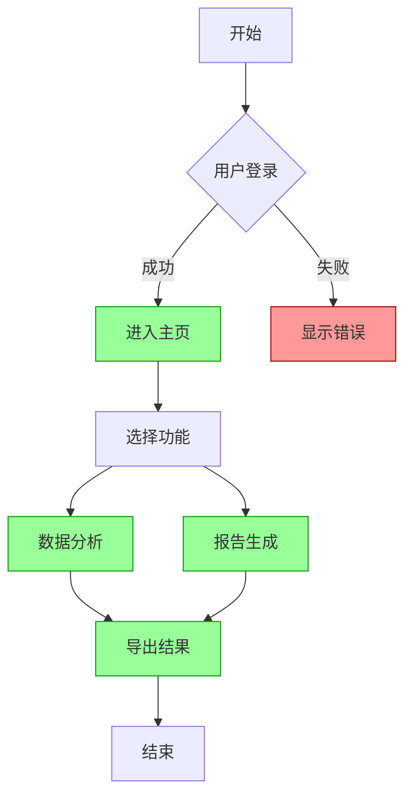
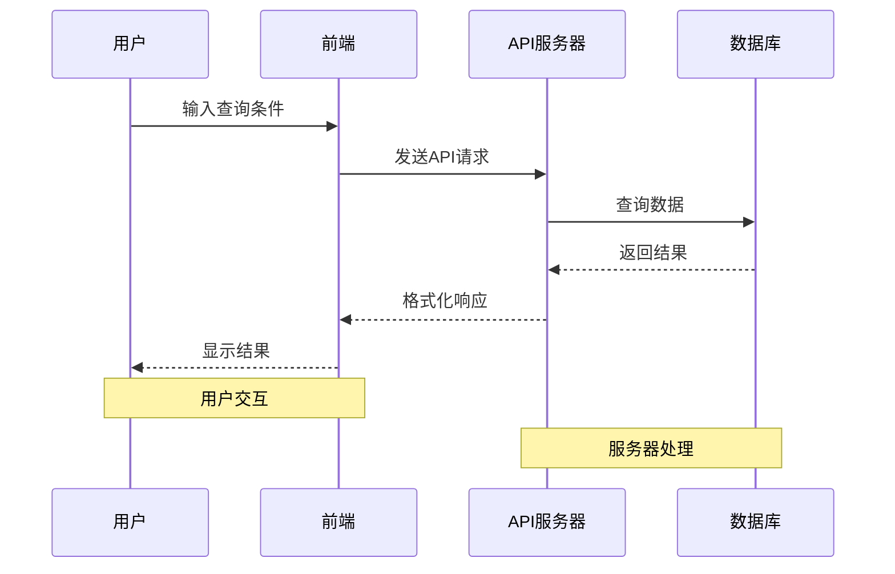
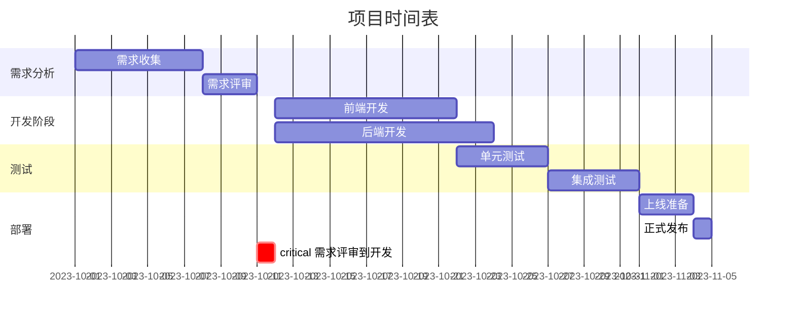
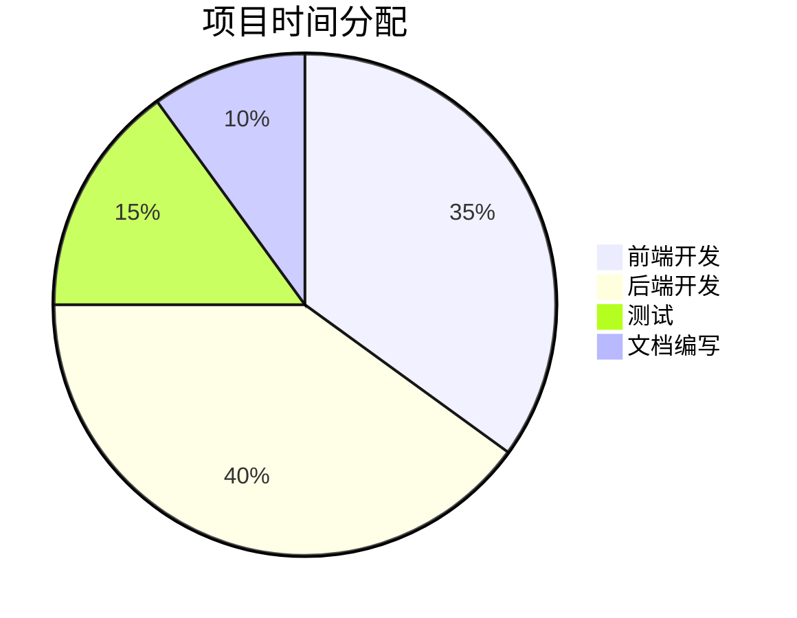
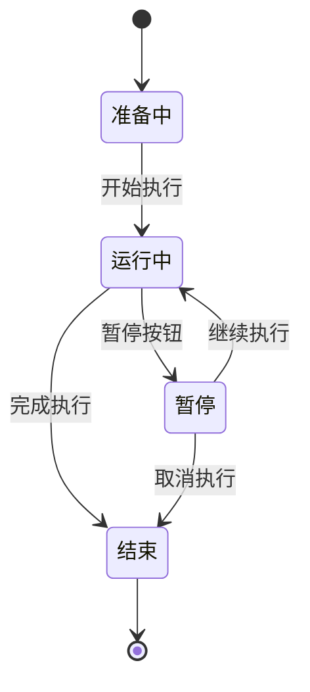
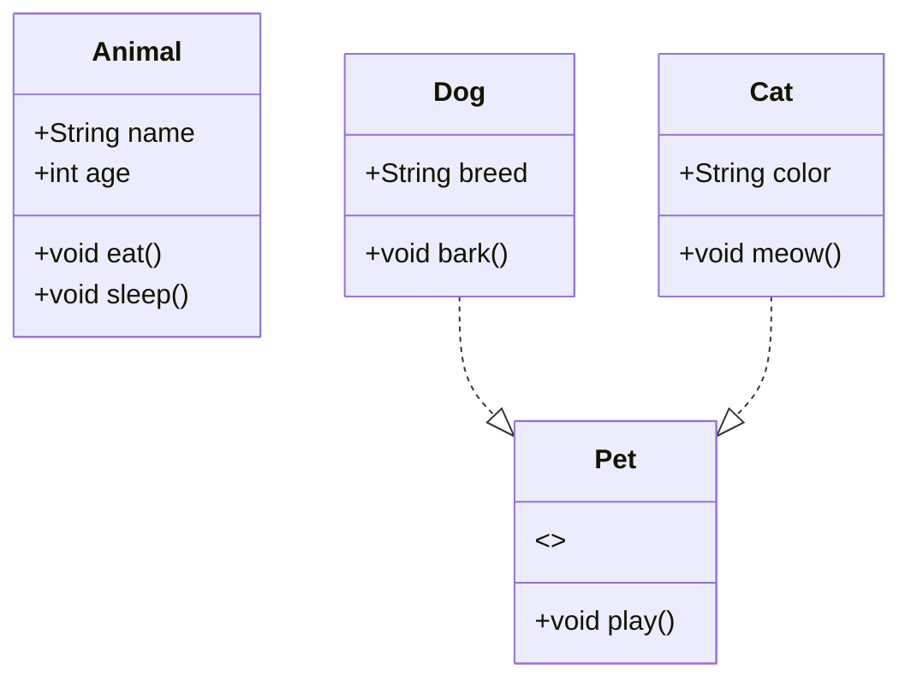

# Mermaid 示例代码

> 这是一种，我觉得类似 md 的文本图示语言，比较优雅吧，所以大概演示一下，以下 Qwen 生成的一些示例代码，能学个七七八八的语法

Mermaid 有以下几种常见的图标示例:

1. 流程图 (Flowchart)
2. 时序图/序列图 (Sequence Diagram)
3. 甘特图 (Gantt Chart)
4. 状态图 (State Diagram)
5. 饼图 (Pie Chart)
6. 类图 (Class Diagram)

