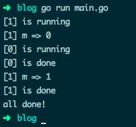

## 原文: [Golang 需要避免踩的 50 坑](https://juejin.cn/post/6844903816018542600)

#### 16. string 类型的值是常量，不可更改

> 尝试使用索引遍历字符串，来更新字符串中的个别字符，是不允许的。

string 类型的值是只读的二进制 byte slice，如果真要修改字符串中的字符，将 string 转为 []byte 修改后，再转为 string 即可：

```go
// 修改字符串的错误示例
func main() {
x := "text"
x[0] = "T" // error: cannot assign to x[0]
fmt.Println(x)
}

// 修改示例
func main() {
x := "text"
xBytes := []byte(x)
xBytes[0] = 'T' // 注意此时的 T 是 rune 类型
x = string(xBytes)
fmt.Println(x) // Text
}
```

> 注意： 上边的示例并不是更新字符串的正确姿势，因为一个 UTF8 编码的字符可能会占多个字节，比如汉字就需要 3~4 个字节来存储，此时更新其中的一个字节是错误的。

更新字串的正确姿势：将 string 转为 rune slice（此时 1 个 rune 可能占多个 byte），直接更新 rune 中的字符

```go
func main() {
x := "text"
xRunes := []rune(x)
xRunes[0] = '我'
x = string(xRunes)
fmt.Println(x) // 我 ext
}
```

#### 18. string 与索引操作符

> 对字符串用索引访问返回的不是字符，而是一个 byte 值。

这种处理方式和其他语言一样，比如 PHP 中：

```bash
> php -r '$name="中文"; var_dump($name);'	# "中文" 占用 6 个字节
string(6) "中文"
> php -r '$name="中文"; var_dump($name[0]);' # 把第一个字节当做 Unicode 字符读取，显示 U+FFFD
string(1) "�"
> php -r '$name="中文"; var_dump($name[0].$name[1].$name[2]);'
string(3) "中"
```

```go
func main() {
	x := "ascii"
	fmt.Println(x[0])		// 97
	fmt.Printf("%T\n", x[0])// uint8
}
```

说白了就是整体读取， for range 次数不一定等于字符串长度

如果需要使用 `for range` 迭代访问字符串中的字符（unicode code point / rune），标准库中有 `"unicode/utf8"` 包来做 UTF8 的相关解码编码。另外 utf8string 也有像`func (s \*String) At(i int) rune`等很方便的库函数。

#### 19. 字符串并不都是 UTF8 文本

> string 的值不必是 UTF8 文本，可以包含任意的值。只有字符串是文字字面值时才是 UTF8 文本，字串可以通过转义来包含其他数据。

判断字符串是否是 UTF8 文本，可使用 "unicode/utf8" 包中的 `ValidString()` 函数：

```go
func main() {
str1 := "ABC"
fmt.Println(utf8.ValidString(str1)) // true

    str2 := "A\xfeC"
    fmt.Println(utf8.ValidString(str2))	// false

    str3 := "A\\xfeC"
    fmt.Println(utf8.ValidString(str3))	// true	// 把转义字符转义成字面值

}
```

#### 20. 字符串的长度

在 Python 中：

```python
data = u'♥'
print(len(data)) # 1
```

然而在 Go 中：

```go
func main() {
	char := "♥"
	fmt.Println(len(char))	// 3
}
```

Go 的内建函数 `len()` 返回的是字符串的 byte 数量，而不是像 Python 中那样是计算 Unicode 字符数。

如果要得到字符串的字符数，可使用 `"unicode/utf8"` 包中的 `RuneCountInString(str string) (n int)`

```go
func main() {
	char := "♥"
	fmt.Println(utf8.RuneCountInString(char))	// 1
}
```

> 注意： `RuneCountInString` 并不总是返回我们看到的字符数，因为有的字符会占用 2 个 `rune`：

```go
func main() {
char := "é"
fmt.Println(len(char)) // 3
fmt.Println(utf8.RuneCountInString(char)) // 2
fmt.Println("cafe\u0301") // café // 法文的 cafe，实际上是两个 rune 的组合
}
```

#### 23. 对内建数据结构的操作并不是同步的

> 尽管 Go 本身有大量的特性来支持并发，但并不保证并发的数据安全，用户需自己保证变量等数据以原子操作更新。

goroutine 和 channel 是进行原子操作的好方法，或使用 "sync" 包中的锁。

#### 24. range 迭代 string 得到的值

> range 得到的索引是字符值（Unicode point / rune）第一个字节的位置，与其他编程语言不同，这个索引并不直接是字符在字符串中的位置。注意一个字符可能占多个 rune，比如法文单词 café 中的 é。操作特殊字符可使用 norm 包。

for range 迭代会尝试将 string 翻译为 UTF8 文本，对任何无效的码点都直接使用 0XFFFD rune（�）UNicode 替代字符来表示。如果 string 中有任何非 UTF8 的数据，应将 string 保存为 byte slice 再进行操作。

```go
func main() {
	data := "A\xfe\x02\xff\x04"
	for _, v := range data {
		fmt.Printf("%#x ", v)	// 0x41 0xfffd 0x2 0xfffd 0x4	// 错误
	}

	for _, v := range []byte(data) {
		fmt.Printf("%#x ", v)	// 0x41 0xfe 0x2 0xff 0x4	// 正确
	}
}
```

#### 26. switch 中的 fallthrough 语句

> switch 语句中的 case 代码块会默认带上 break，但可以使用 fallthrough 来强制执行下一个 case 代码块。

```go
func main() {
	isSpace := func(char byte) bool {
		switch char {
		case ' ':	// 空格符会直接 break，返回 false // 和其他语言不一样
		// fallthrough	// 返回 true
		case '\t':
			return true
		}
		return false
	}
	fmt.Println(isSpace('\t'))	// true
	fmt.Println(isSpace(' '))	// false
}
```

不过你可以在 case 代码块末尾使用 fallthrough，强制执行下一个 case 代码块。

也可以改写 case 为多条件判断：

```go
func main() {
	isSpace := func(char byte) bool {
		switch char {
		case ' ', '\t':
			return true
		}
		return false
	}
	fmt.Println(isSpace('\t'))	// true
	fmt.Println(isSpace(' '))	// true
}
```

#### 31. 程序退出时还有 goroutine 在执行

> 程序默认不等所有 goroutine 都执行完才退出，这点需要特别注意：

```go
// 主程序会直接退出
func main() {
workerCount := 2
for i := 0; i < workerCount; i++ {
go doIt(i)
}
time.Sleep(1 \* time.Second)
fmt.Println("all done!")
}

func doIt(workerID int) {
fmt.Printf("[%v] is running\n", workerID)
time.Sleep(3 \* time.Second) // 模拟 goroutine 正在执行
fmt.Printf("[%v] is done\n", workerID)
}
```

如下，main() 主程序不等两个 goroutine 执行完就直接退出了：


常用解决办法：使用 "WaitGroup" 变量，它会让主程序等待所有 goroutine 执行完毕再退出。

如果你的 goroutine 要做消息的循环处理等耗时操作，可以向它们发送一条 kill 消息来关闭它们。或直接关闭一个它们都等待接收数据的 channel：

```go
// 等待所有 goroutine 执行完毕
// 进入死锁
func main() {
var wg sync.WaitGroup
done := make(chan struct{})

    workerCount := 2
    for i := 0; i < workerCount; i++ {
    	wg.Add(1)
    	go doIt(i, done, wg)
    }

    close(done)
    wg.Wait()
    fmt.Println("all done!")

}

func doIt(workerID int, done <-chan struct{}, wg sync.WaitGroup) {
fmt.Printf("[%v] is running\n", workerID)
defer wg.Done()
<-done
fmt.Printf("[%v] is done\n", workerID)
}
```

执行结果：


看起来好像 goroutine 都执行完了，然而报错：

fatal error: all goroutines are asleep - deadlock!

为什么会发生死锁？goroutine 在退出前调用了 wg.Done() ，程序应该正常退出的。

原因是 goroutine 得到的 "WaitGroup" 变量是 var wg WaitGroup 的一份拷贝值，即 doIt() 传参只传值。所以哪怕在每个 goroutine 中都调用了 wg.Done()， 主程序中的 wg 变量并不会受到影响。

```go
// 等待所有 goroutine 执行完毕
// 使用传址方式为 WaitGroup 变量传参
// 使用 channel 关闭 goroutine

func main() {
	var wg sync.WaitGroup
	done := make(chan struct{})
	ch := make(chan interface{})

	workerCount := 2
	for i := 0; i < workerCount; i++ {
		wg.Add(1)
        go doIt(i, ch, done, &wg)	// wg 传指针，doIt() 内部会改变 wg 的值
	}

	for i := 0; i < workerCount; i++ {	// 向 ch 中发送数据，关闭 goroutine
		ch <- i
	}

	close(done)
	wg.Wait()
	close(ch)
	fmt.Println("all done!")
}

func doIt(workerID int, ch <-chan interface{}, done <-chan struct{}, wg *sync.WaitGroup) {
	fmt.Printf("[%v] is running\n", workerID)
	defer wg.Done()
	for {
		select {
		case m := <-ch:
			fmt.Printf("[%v] m => %v\n", workerID, m)
		case <-done:
			fmt.Printf("[%v] is done\n", workerID)
			return
		}
	}
}
```

执行结果:



//前面的区域以后再来探索吧
