# UML 类图

> 本案例用 md 内嵌 mermaid 实现

其实我们说，类图就包含两个东西，类与类的关系

## 类

> 类是具有相似结构、行为和关系的一组对象的描述符，是面向对象系统中最重要的构造块。

例如：

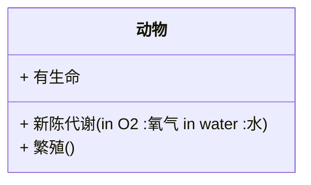

你会发现在这个例子中，有三个格子，分别是

- 类名称（接口要斜体）
- 类的特性（类的字段或属性）
- 类的操作（类的方法和行为）

它们前面的符号有三类：

- `+`表示 public
- `-`表示 private
- `#`表示 protected

## 类的关系

### 1.依赖关系（虚箭线）

> 所谓依赖关系，就是构造这个类的时候，需要依赖其他的类，比如：动物依赖水和氧气。如下图所以：

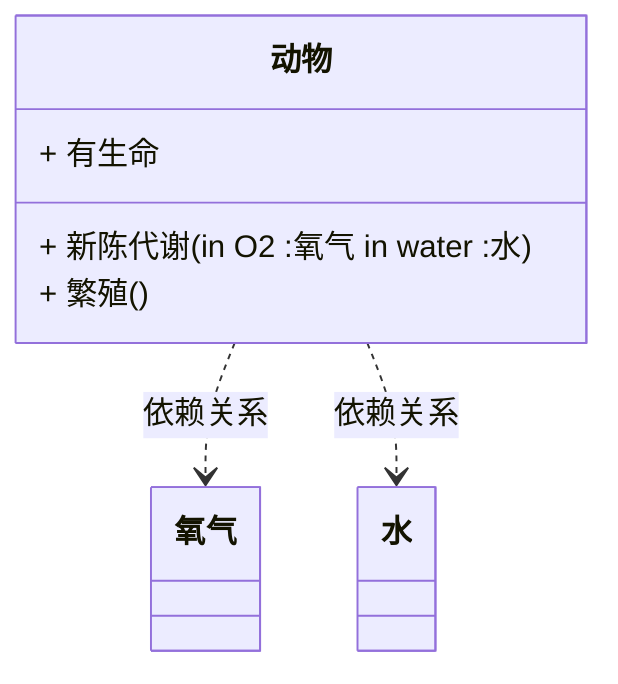

mermaid 没法实现引出来一个分支来画，但是两个可以都打 tag

### 2.继承、泛化关系（实线空心三角箭头）

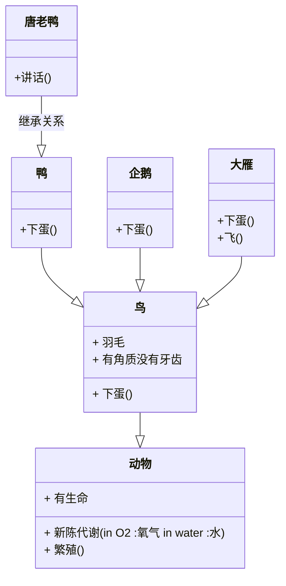

### 3.实现关系（虚线空心三角箭头）

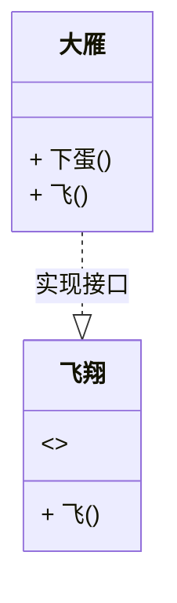

mermaid 貌似不能实现 `<<interface>>` 这种东西，只能照着 class 声明接口的方法来（就是往里面塞个`<>`），或者说用 Ixxxx 标识接口

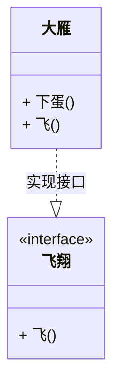

欸，我自己发现的这样好像可以表示飞翔上面一个`<<interface>>`

然后 note 语法不支持，不知道为啥，note 的话写 md 里好了

这是接口的矩阵表示法，顶端有`<<interface>>`
但是我这个不太一样的是，我这个还是会有三行
接口类的话应该是两行
第一行名称，第二行方法

然后是第二章棒棒糖表示法

- 圆圈旁为接口名称
- 接口方法在实现类中出现

这个 mermaid 没法原生支持

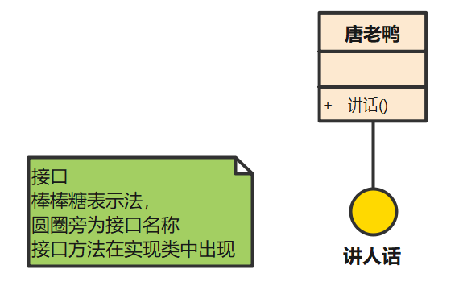

展示一张演示图

### 4.关联关系（实箭线）

> 所谓关联关系，就是这个类有一个属性是其他类。

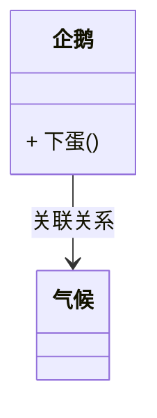

### 5.聚合关系（实线空心菱形）

> 聚合关系是关联关系的一种，是强的关联关系 ；
> 特点： 部分对象的生命周期并不由整体对象来管理。也就是说，当整体对象已经不存在的时候，部分的对象还是可能继续存在的。比如：一只大雁脱离了雁群，依然是可以继续存活的。

uml 类图里面是这样表示的
[整体] ◇—————→ [部分]

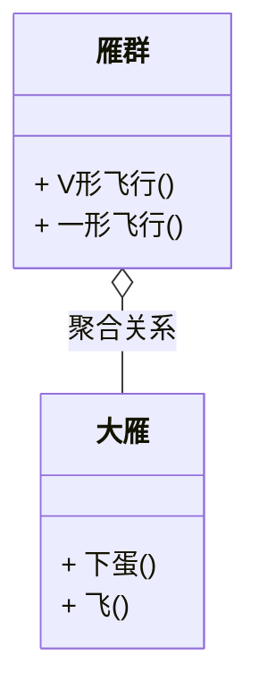

### 6.组合关系（实线实心菱形）

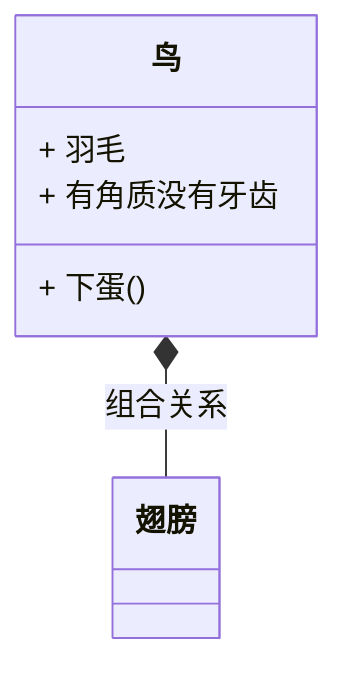

## 补充

大概就是这样了
但是关于 mermaid 的关系语法还有些要说的

比如我们要表示数量上的关系
符号 | 含义
-|-
"1"|恰好一个
"0..1"|零个或一个
"\*"或"0..\*"|零个或多个
"1..\*"|一个或多个
"n"|恰好 n 个
"m..n"|m 到 n 个
"5..\*"|至少五个

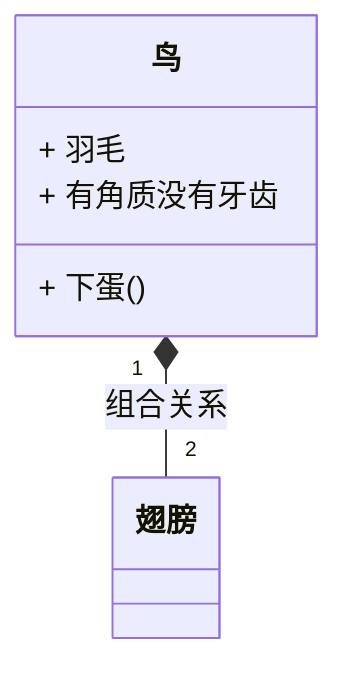

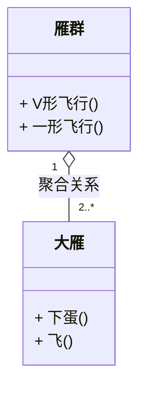

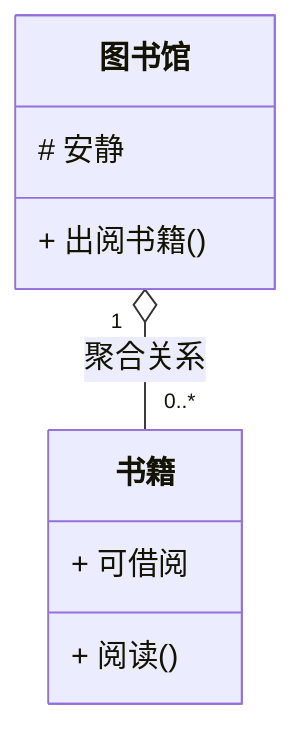
